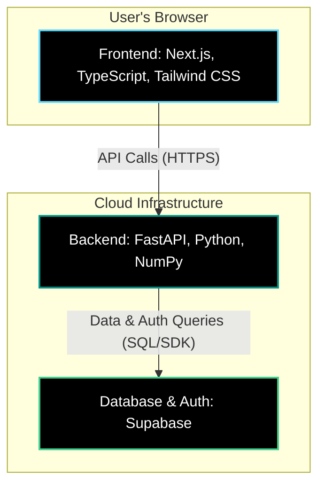

# StackSmart - Net Worth Optimizer

A web application that helps college students make mathematically optimal financial decisions: should they pay off debt or invest their spare cash?

## The Problem

Students often face the dilemma: "I have $100 extra this month. Should I pay down my student loan or invest it?"

This app solves that by comparing:
- **Scenario A**: Paying extra toward debt (guaranteed return = loan interest saved)
- **Scenario B**: Investing in the market (expected return = 10% annually - S&P 500 historical average)

## Features

- **Debt-Aware Investing**: Compares loan interest rates vs. market returns
- **Specific Investment Recommendations**: Get exact ETF allocations with ticker symbols (VOO, VXUS, BND)
- **Risk-Adjusted Portfolios**: Automatic strategy adjustment based on time until graduation
- **Visual Projections**: See your net worth trajectory over time for both strategies
- **How-to-Invest Guide**: Step-by-step instructions for executing the investment plan
- **Clear Recommendations**: Get a definitive answer with confidence scoring
- **College-Optimized**: Designed for 4-year graduation timelines
- **Plaid Integration**: Connect real bank accounts for automatic data import
- **Live Market Data**: Real-time S&P 500 data via Alpha Vantage
- **User Authentication**: Secure accounts with Supabase (signup, login, profile management)

## Tech Stack

### Backend
- **FastAPI**: Python web framework for the API
- **NumPy**: Financial calculations and optimization engine
- **Pydantic**: Data validation
- **Supabase**: PostgreSQL database and authentication

### Frontend
- **Next.js 14**: React framework with App Router
- **TypeScript**: Type-safe development
- **Tailwind CSS**: Modern, dark-mode UI
- **Chart.js**: Interactive data visualizations
- **Supabase JS Client**: Authentication and real-time database access

## Architecture



## Getting Started

### Prerequisites

- Python 3.9+ (for backend)
- Node.js 18+ (for frontend)
- npm or yarn
- A Supabase account ([supabase.com](https://supabase.com))

### Installation

#### 1. Clone the repository

```bash
git clone <repo-url>
cd StackSmart
```

#### 2. Set up Supabase

See [docs/SUPABASE-SETUP.md](docs/SUPABASE-SETUP.md) for detailed instructions.

#### 3. Set up the Backend

```bash
cd net-worth-optimizer/backend

# Create a virtual environment
python -m venv venv

# Activate virtual environment
# On macOS/Linux:
source venv/bin/activate
# On Windows:
# venv\Scripts\activate

# Install dependencies
pip install -r requirements.txt

# Configure environment variables
cp .env.example .env
# Edit .env with your Supabase credentials

# Run the FastAPI server
uvicorn app.main:app --reload
```

The backend will start at `http://localhost:8000`

#### 4. Set up the Frontend

Open a **new terminal window** (keep the backend running), then:

```bash
cd net-worth-optimizer/frontend

# Install dependencies
npm install

# Configure environment variables
cp .env.example .env.local
# Edit .env.local with your Supabase credentials

# Run the development server
npm run dev
```

The frontend will start at `http://localhost:3000`

## User Accounts & Authentication

StackSmart includes **secure user authentication** powered by Supabase.

### Authentication Features

- **Sign Up**: Create account with email and password
- **Sign In**: Secure login with encrypted sessions
- **Protected Pages**: Dashboard, Settings, and financial data only accessible to authenticated users
- **Profile Management**: Update full name and password
- **Session Persistence**: Stay logged in across page refreshes
- **Security**: JWT tokens, PKCE flow, and RLS database policies

### Testing Authentication

1. Go to `http://localhost:3000/auth/signup`
2. Create an account with email and password
3. Sign in with your credentials
4. Access protected pages like Dashboard and Settings

## Example Scenarios

### Scenario 1: High-Interest Loan (9%)
- **Loan**: $25,000 at 9% interest
- **Spare Cash**: $100/month
- **Result**: Pay Debt (guaranteed 9% return beats market's 7%)

### Scenario 2: Low-Interest Loan (3%)
- **Loan**: $25,000 at 3% interest
- **Spare Cash**: $100/month
- **Result**: Invest (market's 7% beats loan's 3%)

## Project Structure

```
StackSmart/
├── README.md
├── docs/
│   ├── DATABASE-SCHEMA.md
│   ├── ENVIRONMENT-SETUP.md
│   ├── SUPABASE-SETUP.md
│   └── SUPABASE-SQL-EDITOR-GUIDE.md
└── net-worth-optimizer/
    ├── backend/
    │   ├── app/
    │   │   ├── main.py
    │   │   ├── middleware/auth.py
    │   │   ├── models/schemas.py
    │   │   └── services/
    │   │       ├── optimization_engine.py
    │   │       └── user_service.py
    │   ├── migrations/
    │   │   └── 001_create_schema.sql
    │   └── requirements.txt
    └── frontend/
        ├── app/
        │   ├── auth/
        │   │   ├── login/
        │   │   └── signup/
        │   ├── settings/
        │   ├── components/
        │   ├── context/AuthContext.tsx
        │   ├── page.tsx
        │   ├── layout.tsx
        │   └── globals.css
        ├── lib/
        │   ├── api.ts
        │   ├── auth.ts
        │   └── supabase.ts
        ├── middleware.ts
        └── types/index.ts
```

## API Documentation

Once the backend is running, visit `http://localhost:8000/docs` for interactive API documentation (Swagger UI).

### Main Endpoint

**POST** `/api/optimize`

Request body:
```json
{
  "loan": {
    "principal": 25000,
    "interest_rate": 0.09,
    "minimum_payment": 200,
    "loan_name": "Student Loan"
  },
  "monthly_budget": 100,
  "months_until_graduation": 48,
  "market_assumptions": {
    "expected_annual_return": 0.07,
    "volatility": 0.15,
    "risk_free_rate": 0.04
  }
}
```

Response:
```json
{
  "recommendation": "pay_debt",
  "net_worth_debt_path": -15234.56,
  "net_worth_invest_path": -18567.89,
  "monthly_breakdown": [...],
  "crossover_month": null,
  "confidence_score": 0.85
}
```

## Documentation

| Topic | File |
|-------|------|
| Supabase setup | [docs/SUPABASE-SETUP.md](docs/SUPABASE-SETUP.md) |
| Environment variables | [docs/ENVIRONMENT-SETUP.md](docs/ENVIRONMENT-SETUP.md) |
| Database schema | [docs/DATABASE-SCHEMA.md](docs/DATABASE-SCHEMA.md) |
| SQL editor guide | [docs/SUPABASE-SQL-EDITOR-GUIDE.md](docs/SUPABASE-SQL-EDITOR-GUIDE.md) |
| Plaid integration | [net-worth-optimizer/COMPLETE-PLAID-GUIDE.md](net-worth-optimizer/COMPLETE-PLAID-GUIDE.md) |
| Platform guide | [net-worth-optimizer/COMPLETE-PLATFORM-GUIDE.md](net-worth-optimizer/COMPLETE-PLATFORM-GUIDE.md) |
| Auth architecture | [net-worth-optimizer/docs/AUTHENTICATION-IMPLEMENTATION-SUMMARY.md](net-worth-optimizer/docs/AUTHENTICATION-IMPLEMENTATION-SUMMARY.md) |
| Auth testing | [net-worth-optimizer/docs/AUTHENTICATION-TESTING-GUIDE.md](net-worth-optimizer/docs/AUTHENTICATION-TESTING-GUIDE.md) |

## Future Enhancements

### Phase 1 (MVP) - Complete
- [x] Basic debt vs. invest comparison
- [x] Single loan support
- [x] User authentication system
- [x] Profile management
- [x] Plan saving and history
- [x] Plaid bank account integration
- [x] Live market data

### Phase 2 (Enhanced Auth)
- [ ] Social login (Google, GitHub OAuth)
- [ ] Password reset via email
- [ ] Two-factor authentication (2FA)

### Phase 3 (ML Integration)
- [ ] Machine learning model for market forecasting
- [ ] Dynamic risk adjustment based on graduation timeline
- [ ] Personalized recommendations based on user history

### Phase 4 (Advanced Features)
- [ ] Multiple loan support
- [ ] Semester-based cash flow predictions
- [ ] Mobile app (iOS/Android)

## Contributing

This is a startup concept/prototype. If you're interested in collaborating, please reach out!

## Disclaimer

This tool is for educational purposes only and does not constitute financial advice. Consult a licensed financial advisor for personalized guidance.

## License

MIT License - feel free to use this for your own projects!
